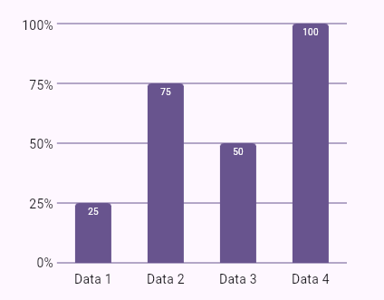
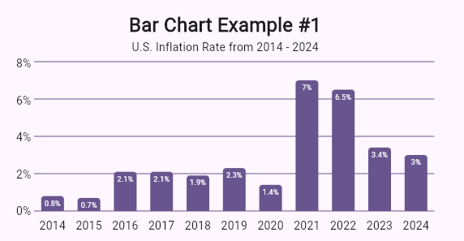

<!--
This README describes the package. If you publish this package to pub.dev,
this README's contents appear on the landing page for your package.

For information about how to write a good package README, see the guide for
[writing package pages](https://dart.dev/guides/libraries/writing-package-pages).

For general information about developing packages, see the Dart guide for
[creating packages](https://dart.dev/guides/libraries/create-library-packages)
and the Flutter guide for
[developing packages and plugins](https://flutter.dev/developing-packages).
-->

A simple bar chart package that turns your data into a bar chart that is customizeable

## Features




See `/example` folder

## Getting started

Simply add the `bar_chart` and git url to your dependencies in `pubspec.yaml` like so:

```dart
dependencies:
  flutter:
    sdk: flutter

  bar_chart:
    git: https://github.com/Salvist/bar_chart.git
```

Then run `flutter pub get`

To always get the latest update, run `flutter pub upgrade bar_chart`

## Usage

TODO: Include short and useful examples for package users. Add longer examples
to `/example` folder.

```dart
const like = 'sample';
```

## Additional information

TODO: Tell users more about the package: where to find more information, how to
contribute to the package, how to file issues, what response they can expect
from the package authors, and more.
